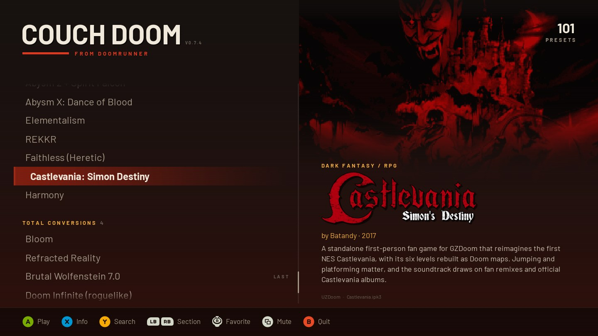
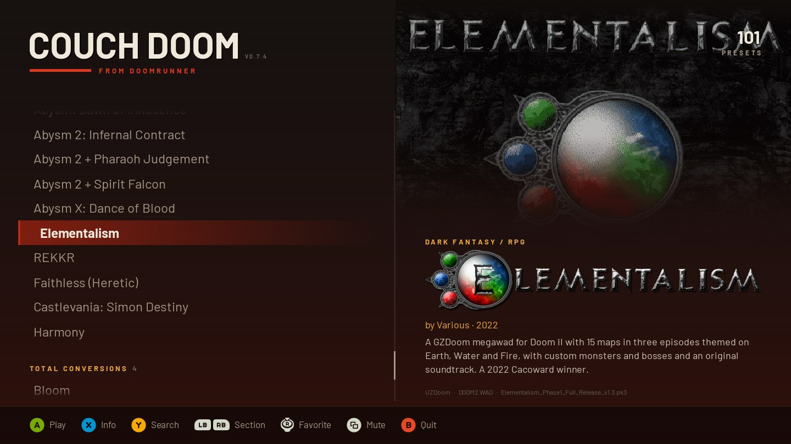
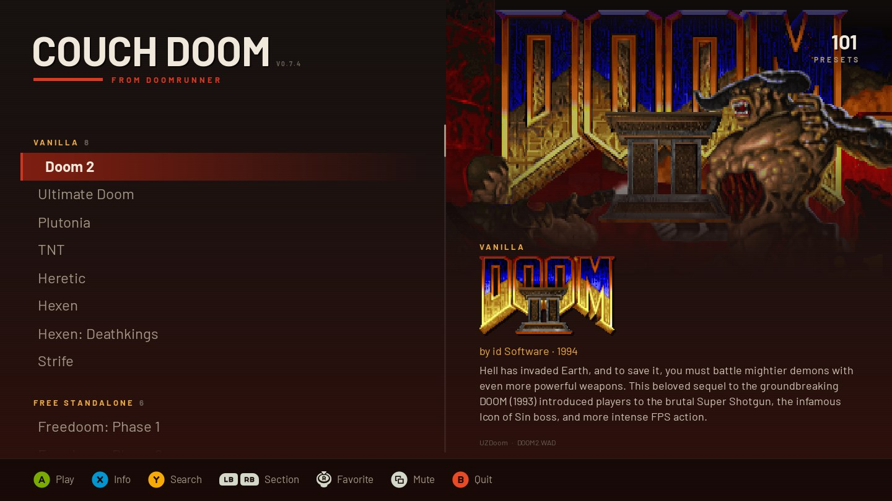

# CouchDoom

Made by [KrisEnigma](https://github.com/KrisEnigma).

A fullscreen, gamepad-friendly front end for the Doom setups you already have. CouchDoom reads your launcher's presets (or the IWADs your source port finds) and shows them big-screen style, with each WAD's own title art, music and readme. Pick one and it starts the engine with the same files and arguments your launcher would use.

Built for playing on the TV, and just as much at home on a Steam Deck: everything works from the controller, and the layout fits the Deck's screen.

It only reads other programs' files, never changes them. Keep setting games up in your launcher.


<p>
  
  
</p>
<p>
  
  
</p>
<p>
  
  
</p>

Title art, logos, readmes and ENDOOM screens belong to their WAD authors; CouchDoom reads them from your own files.

## What it works with

### Launchers

| Launcher | OS | Reads | Where it looks |
| --- | --- | --- | --- |
| [DoomRunner](https://github.com/Youda008/DoomRunner) | Windows, Linux, macOS | `options.json` | Windows `%LOCALAPPDATA%\DoomRunner` or `%APPDATA%\DoomRunner`; Linux `~/.local/share/DoomRunner` or its Flatpak folder; macOS `~/Library/Application Support/DoomRunner`; or the `DOOMRUNNER_OPTIONS` env var |
| [ZDL](https://github.com/lcferrum/qzdl) (qZDL / ZDL 3) | Windows, Linux | `qZDL.ini` and saved `.zdl` files | Windows `%APPDATA%\Vectec Software`; Linux `~/.config/Vectec Software`. `.zdl` files in ZDL's last-used folders and beside its ini |
| [Doom Launcher](https://github.com/nstlaurent/DoomLauncher) | Windows | `DoomLauncher.sqlite` | `%APPDATA%\DoomLauncher` |
| [Doom Launcher 667](https://github.com/Realm667/DoomLauncher667) | Windows | `DoomLauncher.sqlite` | Beside `DoomLauncher667.exe`, `%LOCALAPPDATA%\DoomLauncher667`, or the `DOOMLAUNCHER_DATABASE` env var |

Any engine your launcher runs works, since CouchDoom uses the launcher's own engine list. DoomRunner's per-engine flags carry over too, so DSDA-Doom, PrBoom+, Woof, Chocolate Doom, EDGE and the ZDoom family all get arguments they understand.

- **DoomRunner:** every preset, grouped by its separators, with its launch options (map, skill, gameplay and compat flags, video, audio).
- **ZDL:** the loaded setup plus saved `.zdl` files; subfolders become sections.
- **Doom Launcher:** every game with saved settings, one entry per profile; tags become sections. Zipped files it manages get unpacked into `state/unpacked/` when first needed.
- **Doom Launcher 667:** every game, sectioned by collection. Mods kept as `.7z`/`.rar` only play from Doom Launcher 667 itself.

### Source ports without a launcher

| Port | Reads | Where it looks |
| --- | --- | --- |
| GZDoom, UZDoom, VKDoom | The port's ini (`[IWADSearch.Directories]`), its `iwadinfo.txt` and the IWADs it finds | The program: on `PATH`, `Program Files\<Port>`, beside or one folder up from `CouchDoom.exe`, `/Applications/<Port>.app`, `/usr/bin`, or the GZDoom Flatpak. The ini: `<port>_portable.ini` beside the exe, or `Documents\My Games\<Port>\<port>.ini` (Windows), `~/.config/<port>/<port>.ini` (Linux), `~/Library/Preferences/<port>.ini` (macOS) |

You get one entry per IWAD, named and ordered like the port's own startup picker, including Steam, GOG and Bethesda.net copies (unless `i_searchdistributors` is off). Add-ons like Hexen: Deathkings only show up when their base game is there. Playing one runs the port with `-iwad`, so your autoload folders and settings still apply.

### Finding them

Beyond the locations above, CouchDoom follows Start Menu, Desktop and taskbar shortcuts to these programs, which is how portable installs get found. Settings beside `CouchDoom.exe`, or one folder up, count too.

- **One found:** it opens straight on its presets.
- **Several found:** it asks once and remembers. Switch later with L3 (click the left stick) or F4.
- **None found:** choose **Find it myself…** and pick the launcher, the port or a settings file. Dragging one onto the window works too.


If the settings can't be read or have no presets, CouchDoom shows what went wrong and which paths it tried. It doesn't just close.

## Install

Grab a build from the [latest release](https://github.com/KrisEnigma/couch-doom/releases/latest); no Python needed. The app isn't code-signed, so the first start takes one extra click.

- **Windows:** `CouchDoom-…-windows-x64.zip`. Unzip anywhere and run `CouchDoom.exe`. If SmartScreen complains, click **More info**, then **Run anyway**.
- **macOS:** `…-macos-arm64.zip` for Apple Silicon, `…-macos-x64.zip` for Intel (macOS 10.15+). Unzip and open `CouchDoom.app`. If macOS refuses, go to **System Settings → Privacy & Security** and click **Open Anyway**.
- **Linux:** `…-linux-x64.tar.gz` for PCs, `…-linux-arm64.tar.gz` for ARM boards like the Raspberry Pi 4 and 5. Extract and run `./CouchDoom`. Needs glibc 2.28+ (Ubuntu 20.04, Debian 10, RHEL 8 and later). No 32-bit.
- **Steam Deck:** in Desktop Mode, extract `…-linux-x64.tar.gz`, then in Steam choose **Add a Non-Steam Game** and browse to `CouchDoom`. It then starts from Game Mode like any other game. GZDoom and DoomRunner from Discover (Flatpak) are found automatically. For library art, use the images in [`packaging/steam`](packaging/steam): right-click the tile, then **Manage → Set custom artwork**, and right-click the banner for the background and logo.

**Arch Linux:** an AUR package is coming. For now, install `python-pygame-ce` from the AUR (e.g. `yay -S python-pygame-ce`), then:

```bash
git clone https://github.com/KrisEnigma/couch-doom.git
cd couch-doom/packaging/aur
makepkg -si
```

Use the regular `python-pygame-ce`. The `-sdl3` variant is built without sound or controller support.

**From source** (any OS) needs Python 3.11+. Apple's built-in Python is too old; get one from [python.org](https://www.python.org/downloads/macos/) or Homebrew.

```bash
git clone https://github.com/KrisEnigma/couch-doom.git
cd couch-doom
python3 -m venv .venv
.venv/bin/pip install -r requirements.txt
.venv/bin/pip install --no-deps tinysoundfont   # MIDI title music; optional
PYTHONPATH=src .venv/bin/python -m couch_doom
```

`pip install .` adds a `couch-doom` command instead.

- **Linux:** **Find it myself…** needs `zenity` (or `kdialog` on KDE).
- **macOS:** click the file dialog once before typing; macOS doesn't give it keyboard focus. If GZDoom was downloaded but never opened, open it once from Finder first, or its "downloaded from the internet" prompt hides behind CouchDoom.

Tested on Arch Linux with DSDA-Doom, DoomRunner and qZDL, and on an M4 MacBook Pro with GZDoom. Players run it on Steam Decks too; reports and tips from the Deck are welcome.

## Controls

| Pad | Keyboard | Does |
| --- | --- | --- |
| D-pad / left stick | Arrows | Move (hold to repeat) |
| A / Start | Enter | Play |
| X | Tab | Info sheet: the readme, plus ENDOOM when the WAD has one |
| Y | `/` or just type | Search |
| R3 (click right stick) | F3 | Add to or remove from Favorites |
| Back / View | F2 | Title music on/off |
| L3 (click left stick) | F4 | Choose launcher |
| LB / RB | Left / Right | Previous / next section |
| LT / RT | PgUp / PgDn | Jump 8 presets |
| B | Esc | Clear the filter, otherwise quit (press twice) |

The mouse works too. Click a preset to select it and again to play; the wheel scrolls, right-click acts as B, and footer prompts, tabs and the search keyboard are all clickable.

Favorites get their own section at the top. CouchDoom hides while a game runs and comes back when it exits.

## What you see and hear

Everything comes from the preset's own files, in the order the engine would load them:

- **Backdrop:** the title screen (MAPINFO `titlepage`, `TITLEPIC`, or Heretic/Hexen's `TITLE`). Mods without title art of their own show their loading screen instead. The UI takes its colours from the most vivid hue.
- **Logo:** the logo the main menu draws (`M_DOOM`, `M_HTIC`, `M_STRIFE` or the mod's own), or a logo or title card the mod ships, if it's a real custom one.
- **Title music:** MAPINFO `titlemusic`, the title map's music, a track the title script starts, the title lump (`D_DM2TTL`, `D_INTRO`, `MUS_TITL`, …) or a title-named track. It plays once and crossfades between presets. MIDI and MUS need a SoundFont: `--soundfont <file>`, any `.sf2`/`.sf3` in a `soundfonts/` folder beside CouchDoom, or one shipped with your engine.
- **Readme:** a matching `.txt` beside the WAD, a readme inside the PK3, the WAD's own embedded text, or the info a mod browser saved next to it. Notable mods without any get a built-in line.
- **ENDOOM:** only when the preset ships its own.
- **Menu sounds:** from your IWAD.

WAD, PK3 and IPK3 work; PK7 doesn't.

<p>
  
  
</p>

## Command line

| Option | Does |
| --- | --- |
| `--windowed` | Run in a window instead of fullscreen |
| `--dry-run [--preset text]` | Print each preset's launch command and exit |
| `--options <file>` | Read one settings file, or a GZDoom/UZDoom/VKDoom program |
| `--launcher <name>` | Only consider `doomrunner`, `zdl`, `doomlauncher`, `doomlauncher667` or `gzdoom` |
| `--soundfont <file>` | SoundFont for MIDI title music |

On Windows from source, `run.bat` passes these through. For no console window, point a shortcut at `.venv\Scripts\pythonw.exe -m couch_doom` with `PYTHONPATH` set to the checkout's `src` folder.

## Notes

- **Saved state** (last played, favorites, music toggle, chosen launcher) lives in `state/last_played.json`, beside `CouchDoom.exe` or the source checkout. Installed copies use `%LOCALAPPDATA%\CouchDoom`, `~/.local/share/couch-doom` or `~/Library/Application Support/CouchDoom`.
- **Troubleshooting log:** `state/couch-doom.log` records crashes, "nothing found" reports, and every launch with its command line, exit code and the engine's last output. It never leaves your machine and tops out around 512 KB (older entries rotate into `couch-doom.log.1`). No environment variables, but it does contain file paths, so look it over before sharing.
- **Update notice:** shortly after start, CouchDoom asks GitHub once (no identifiers) whether there's a newer release. If so, you can open it, be reminded next time, or skip that version. Turn it off with `"update_check": false` in `last_played.json` or the `COUCHDOOM_NO_UPDATE_CHECK` environment variable.
- **Your own descriptions:** for a mod CouchDoom can't describe, add a `descriptions.json` to the same `state` folder. Keys are file names, every field is optional, and it beats any readme:

  ```json
  {
    "mymod.wad": { "title": "My Mod", "author": "Someone", "year": 2020, "description": "One or two sentences." }
  }
  ```

- **Descriptions for everyone:** pull requests adding to `COMMUNITY` in `src/couch_doom/known.py` are welcome. Notable WADs only (Cacoward winners, classic megawads, well-known total conversions), and only ones that don't already show a description. One or two factual lines in your own words, plus a source link and the date you checked it. Skip things that change, like version notes.
- **Not supported:** DoomRunner's multiplayer and demo options; Doom Launcher's unmanaged `.7z`/`.rar` files and its ports with a custom file flag.
- **Building the Windows app:** `pip install pyinstaller`, then `pyinstaller packaging/CouchDoom.spec`. Pushing a `v*` tag builds and publishes every platform on GitHub Actions.

## Credits and license

Made and maintained by [KrisEnigma](https://github.com/KrisEnigma). MIT licensed; see [LICENSE](LICENSE).

- **Fonts:** [Barlow](https://github.com/jpt/barlow) and [JetBrains Mono](https://github.com/JetBrains/JetBrainsMono), both SIL OFL.
- **Button prompts:** [Kenney's Input Prompts](https://kenney.nl/assets/input-prompts), CC0. They match what you last used: keyboard, or an Xbox, PlayStation or Switch pad.
