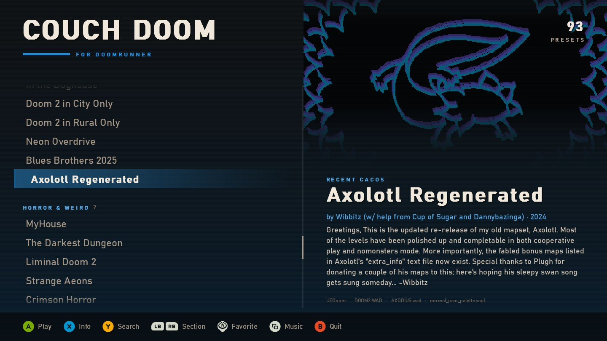

# CouchDoom

Fullscreen gamepad front end for the Doom launcher you already use: [DoomRunner](https://github.com/Youda008/DoomRunner), [ZDL](https://github.com/lcferrum/qzdl) or [Doom Launcher](https://github.com/nstlaurent/DoomLauncher) (classic or [Doom Launcher 667](https://github.com/Realm667/DoomLauncher667)). It reads that launcher's saved setups and starts the engine with the same IWAD, mods and arguments the launcher would use. That includes DoomRunner's per-engine rules, so DSDA-Doom, Woof, Chocolate Doom and other non-ZDoom ports get the flags they understand. It never writes to the launcher's settings; keep setting games up in the launcher itself. No launcher? GZDoom, UZDoom or VKDoom on its own works too: CouchDoom lists the same IWADs the port's startup picker would.


<p>
  
  
  
</p>

Title art, logos, readmes and ENDOOM screens shown here belong to their WAD authors; CouchDoom reads them from your own files.

## Download

Windows: grab `CouchDoom-…-windows-x64.zip` from the [latest release](https://github.com/KrisEnigma/couch-doom/releases/latest), unzip it anywhere and double-click `CouchDoom.exe`. No Python needed. You'll need DoomRunner, ZDL or Doom Launcher with at least one game set up in it, or just GZDoom, UZDoom or VKDoom with an IWAD it can find.

The app isn't code-signed, so Windows SmartScreen may warn about an unknown publisher: click **More info**, then **Run anyway**.

Arch Linux: an AUR package is coming soon. Until then, build the same package from this repo (install `python-pygame-ce` from the AUR first, for example `yay -S python-pygame-ce`):

```bash
git clone https://github.com/KrisEnigma/couch-doom.git
cd couch-doom/packaging/aur
makepkg -si
```

Then run `couch-doom` or pick CouchDoom from your app menu. It needs the regular SDL2 `python-pygame-ce` package, not `python-pygame-ce-sdl3`, which is built without sound or game controller support.

## Linux

DoomRunner and ZDL (qZDL) both run on Linux, and CouchDoom finds their settings in the usual places (see [Which launcher](#which-launcher)). Doom Launcher and Doom Launcher 667 are Windows-only. On other distros, run it from source:

```bash
python -m venv .venv
.venv/bin/pip install -r requirements.txt
PYTHONPATH=src .venv/bin/python -m couch_doom
```

Or `pip install .` from a checkout, which adds a `couch-doom` command. Installed copies keep their state in `~/.local/share/couch-doom/`. For **Find it myself…** in the launcher picker on Linux, install `zenity` (or `kdialog` on KDE); without either, drag the launcher or its settings file onto the window instead. Tested on Arch Linux (WSLg) with DSDA-Doom, DoomRunner and qZDL; reports from Steam Deck and other desktops are welcome.

## macOS

No app bundle yet; run it from source with Python 3.11 or newer (Apple's built-in Python is too old; use [python.org](https://www.python.org/downloads/macos/) or Homebrew):

```bash
git clone https://github.com/KrisEnigma/couch-doom.git
cd couch-doom
python3 -m venv .venv
.venv/bin/pip install -r requirements.txt
.venv/bin/pip install --no-deps tinysoundfont
PYTHONPATH=src .venv/bin/python -m couch_doom
```

Add `--windowed` for a window instead of fullscreen. Fullscreen stays on the current Space, so starting a game doesn't swipe to another one. With GZDoom in `/Applications`, CouchDoom lists the IWADs from GZDoom's own folders (`~/Library/Application Support/GZDoom` and any others listed in `~/Library/Preferences/gzdoom.ini`); DoomRunner and ZDL setups work as well. **Find it myself…** opens the standard macOS file picker, where `GZDoom.app` can be picked directly. Click it once before typing, because macOS doesn't give it keyboard focus. If GZDoom was downloaded and never opened, open it once from Finder so macOS's "downloaded from the internet" prompt doesn't appear behind CouchDoom. `pip install .` also works and adds a `couch-doom` command; installed copies keep their state in `~/Library/Application Support/CouchDoom/`. Tested on an M4 MacBook Pro with macOS 26 and GZDoom.

## Run from source

```powershell
python -m venv .venv
.\.venv\Scripts\python -m pip install -r requirements.txt
.\.venv\Scripts\python -m pip install --no-deps tinysoundfont
```

Uses `pygame-ce` (imports as `pygame`), which ships wheels for current Python versions. `tinysoundfont` renders MIDI title music; install it with `--no-deps` because its optional live-playback dependency (PyAudio) has no wheel for new Pythons and isn't used here. Without it, MIDI title tracks are skipped and everything else works.

| Command | What it does |
| --- | --- |
| `.\run.bat` | Fullscreen, with console output |
| `.\run.bat --windowed` | Windowed, with console output |
| `.\run.bat --dry-run [--preset text]` | Print the launch command for each preset and exit |

For the couch, launch it without a console from a shortcut or a `.bat` anywhere (for example next to your launcher):

```bat
@echo off
set "COUCH=C:\path\to\couch-doom"
set "PYTHONPATH=%COUCH%\src"
start "" "%COUCH%\.venv\Scripts\pythonw.exe" -m couch_doom %*
```

To build the `.exe` yourself: `pip install pyinstaller`, then `pyinstaller packaging/CouchDoom.spec` (output in `dist/CouchDoom/`). Pushing a `v*` tag does the same on GitHub Actions and publishes the zip as a release.

## Which launcher

On first run CouchDoom looks for each launcher's settings:

| Launcher | Settings | Looked for in |
| --- | --- | --- |
| DoomRunner | `options.json` | Windows: `%LOCALAPPDATA%` / `%APPDATA%\DoomRunner`. Linux: `~/.local/share/DoomRunner` (or its Flatpak folder). macOS: `~/Library/Application Support/DoomRunner`. Or the `DOOMRUNNER_OPTIONS` env var anywhere |
| ZDL | `qZDL.ini` (plus saved `.zdl` setups near it) | Windows: `%APPDATA%\Vectec Software`. Linux/macOS: `~/.config/Vectec Software` |
| Doom Launcher | `DoomLauncher.sqlite` | `%APPDATA%\DoomLauncher` (installed) |
| Doom Launcher 667 | `DoomLauncher.sqlite` | beside `DoomLauncher667.exe`, `%LOCALAPPDATA%\DoomLauncher667`, or the `DOOMLAUNCHER_DATABASE` env var |
| GZDoom / UZDoom / VKDoom (no launcher) | the port's own `.ini` | The program on your `PATH`, under `Program Files`, beside or one folder up from `CouchDoom.exe`, `/Applications/<Port>.app` on macOS, `/usr/bin` or the GZDoom Flatpak on Linux |

Both Doom Launchers use the same database file; CouchDoom tells them apart by the tables Doom Launcher 667 adds on its first start. It also follows your Start Menu, Desktop and taskbar shortcuts to `DoomRunner.exe`, `zdl.exe`, `DoomLauncher.exe`, `DoomLauncher667.exe`, `gzdoom.exe`, `uzdoom.exe` or `vkdoom.exe`, which is how portable installs get found. Settings beside `CouchDoom.exe` or one folder up count too, so the CouchDoom folder can also sit inside a portable launcher's folder.

- **One found:** it opens straight on that launcher's presets.
- **Several found:** a picker asks which one, showing each launcher's preset count. The choice is remembered.
- **Switch any time:** L3 (click the left stick) or F4, or click the "For …" tag under the logo.
- **Not found:** pick **Find it myself…** in the picker to browse to the launcher's program (its `.exe` on Windows) or settings file, or drag either one (or the launcher's folder) onto the window. CouchDoom remembers it.

How each launcher's setups show up:

- **DoomRunner:** every preset, grouped by DoomRunner's own separators, with its launch options (map, skill, gameplay and compat flags, video, audio).
- **ZDL:** the setup currently loaded in ZDL, plus the `.zdl` files in the folders ZDL last used and next to its `.ini` (subfolders become sections).
- **Doom Launcher:** every game with saved settings, and each of its profiles as a separate entry; tags become sections, and untagged games go last. Zipped (managed) files are unpacked into `state/unpacked/` the first time they're shown or played.
- **Doom Launcher 667:** every game, sectioned by its collections in name order. It has no profiles, so each game is one entry, and its own file always loads first. Mods it keeps as `.7z`/`.rar` only play from Doom Launcher 667 itself.
- **GZDoom, UZDoom or VKDoom on its own:** one entry per IWAD, named and ordered as in the port's startup picker. CouchDoom reads the folders under `[IWADSearch.Directories]` in the port's ini (`uzdoom_portable.ini` beside the exe, `Documents\My Games\UZDoom\uzdoom.ini`, `~/.config/uzdoom/uzdoom.ini` or `~/Library/Preferences/gzdoom.ini`, depending on port and OS), plus Steam, GOG and Bethesda.net installs unless `i_searchdistributors` is off. Each file is identified by the port's own `iwadinfo.txt`, so add-ons that need another IWAD (Hexen: Deathkings) only show up when that IWAD is there too. Picking one starts the port with `-iwad`, so its autoload folders and settings apply as usual.

On the command line, `--options <file>` reads one settings file (or a port's program) and `--launcher doomrunner|zdl|doomlauncher|doomlauncher667|gzdoom` only considers that launcher.

If the settings are missing, can't be parsed, or have no presets, CouchDoom opens on a notice explaining what's wrong and listing the paths it tried, instead of closing. Press A / Enter to look again once it's fixed (for example after saving a preset); B / Esc quits. The problem is also written to the log, and `--dry-run` prints it and exits with code 2 (or 1 when there are no presets).

## Controls

| Pad | Keyboard | List | Search keyboard |
| --- | --- | --- | --- |
| D-pad / left stick | Arrows | Move (hold to repeat) | Move key |
| A / Start | Enter | Play | Type key (Start plays) |
| X | Tab | Info sheet (Readme / Command / ENDOOM tabs) | Delete |
| Y | `/` or just type | Open search | Done |
| R3 (click right stick) | F3 | Add to / remove from Favorites | |
| Back / View | F2 | Title music on/off (remembered) | |
| L3 (click left stick) | F4 | Choose launcher | |
| B | Esc | Clear filter, else quit (press twice) | Cancel and clear |
| LB / RB, D-pad left/right | Left / Right | Previous / next section | |
| LT / RT | PgUp / PgDn | Jump 8 presets | |

Mouse: click a preset to select it, click it again (or double-click) to play. The wheel scrolls the list without changing the selection (the next pad or keyboard move brings the selection back into view) or scrolls the info sheet, and both scrollbars can be dragged (click the track to jump). Right-click (or the mouse's back button) works like B, and every footer prompt, info tab and on-screen key is clickable. Clicking outside the info sheet or search keyboard closes it. The pointer only appears once you move the mouse, and hides again when you use the pad or keyboard.

In the info sheet: LB/RB or Left/Right switch tabs (each tab keeps its scroll position until the sheet closes), right stick or Up/Down scroll, LT/RT or PgUp/PgDn page, A/Start/Enter plays, B/Esc closes.

Favorites get their own section at the top of the list (they stay in their own section too, marked with a star), and the launcher opens on them: on the last-played one if it's a favorite, otherwise on the first.

The launcher window closes while the game runs and comes back when the engine exits. If the engine exits with an error within 15 seconds, the exit code is shown.

## Title music, readmes and sounds

Nothing here depends on a particular engine; it all comes from the preset's own files.

- **Title music** starts as soon as you land on a preset and crossfades with the previous one; it plays once, like the title screen. Recent tracks are cached so flipping back is instant. Two streamed tracks (OGG/MP3/modules) can't overlap in SDL_mixer, so the next one waits for the previous fade-out. It's the MAPINFO `titlemusic` if set, otherwise the IWAD's own title lump (`D_DM2TTL`, `D_INTRO`, `MUS_TITL`, ...), searched in override order. OGG/MP3/FLAC and tracker modules stream through SDL_mixer; MUS is converted to MIDI and MIDI is rendered with a SoundFont.
- **SoundFont** for MIDI, first match wins: `--soundfont <file>`, the `DOOMRUNNER_SOUNDFONT` env var, any `.sf2`/`.sf3` in this project's `soundfonts/` folder, then any shipped next to a configured engine (its folder or a `soundfonts/` subfolder). The largest file in a tier is used. No SoundFont means MIDI tracks stay silent.
- **Readme** is a same-named `.txt` beside the map/mod file, or a readme/credits text at the root of a PK3. Map packs are checked before mods. idgames-style headers fill the author, year and description under the title.
- **Logos** replace the text title in the details panel: the preset's own main-menu logo (`M_DOOM`, `M_HTIC`, `M_STRIFE`), or the IWAD's when nothing else is loaded. Mods that re-ship or recolour the stock logo, and blank, full-screen or frame-shaped "logos", keep the text title.
- **ENDOOM** is the 80x25 text screen ports show on exit. The tab appears only when the preset's own files ship one (`ENDOOM`, `ENDTEXT`, `ENDSTRF`); the stock IWAD screen is skipped.
- **Colours follow the title art**: the most vivid hue in the art tints the background, labels, stripe and selection bar, and crossfades with the art. Red/orange, grey or dark art keeps the house red and gold.
- **UI sounds** are Doom's own menu sounds (`DSPSTOP`, `DSPISTOL`, `DSSWTCHN`, `DSSWTCHX`, `DSOOF`) read from the IWAD most of your presets use. No Doom-format IWAD, no sounds.
- The audio device is released while a game runs.

## Notes

- The backdrop is each preset's own title screen, read from its files in engine override order: a MAPINFO `titlepage`, then `TITLEPIC`, then Heretic/Hexen's raw `TITLE`. WAD and PK3/IPK3 are supported; PK7 is not.
- Text uses Windows' Bahnschrift where available; elsewhere it's [Barlow](https://github.com/jpt/barlow) (SIL OFL, `src/couch_doom/assets/fonts/`).
- Button prompts are [Kenney's Input Prompts](https://kenney.nl/assets/input-prompts) (CC0, `src/couch_doom/assets/prompts/`). The style follows the pad you last pressed a button on: Xbox, PlayStation (detected by name) or Switch.
- Last played preset, favorites, the music toggle and the chosen launcher are stored in `state/last_played.json` (beside `CouchDoom.exe` or the source checkout; `~/.local/share/couch-doom/`, `~/Library/Application Support/CouchDoom/` or `%LOCALAPPDATA%\CouchDoom\` for pip/AUR installs).
- Crashes under `pythonw` (no console) are written to `state/couch-doom.log`.
- Map packs that point at a folder load every game file inside it, sorted by name.
- DoomRunner option groups supported: launch mode (map/save), gameplay flags, compat flags, video resolution/FPS, audio mute. Multiplayer and demo options are ignored.
- Doom Launcher: `.7z`/`.rar` files it doesn't manage, Doomsday's special `-game` argument and ports with a custom file flag aren't supported yet.

## License

MIT, see [LICENSE](LICENSE). Button prompts are CC0 (see above).
