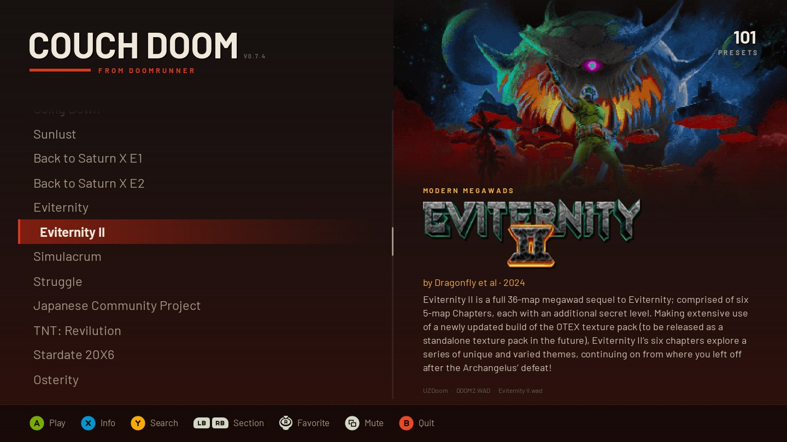
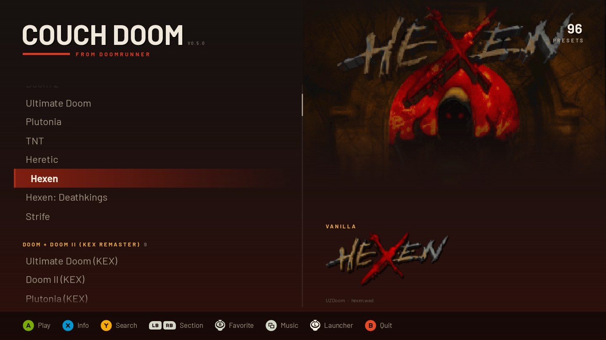
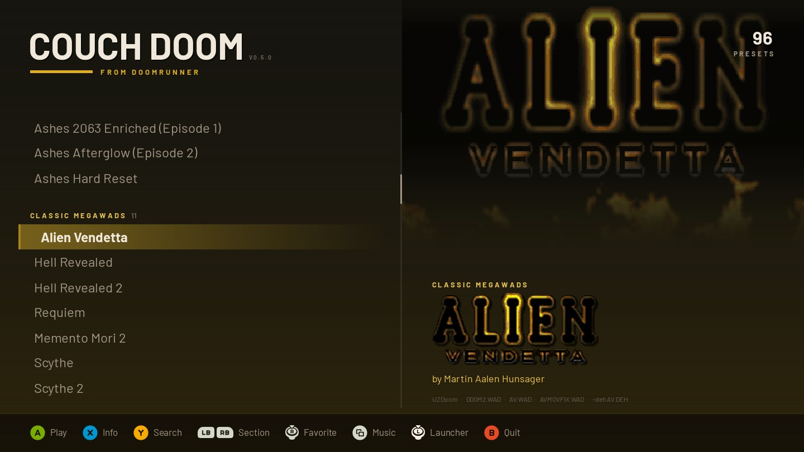
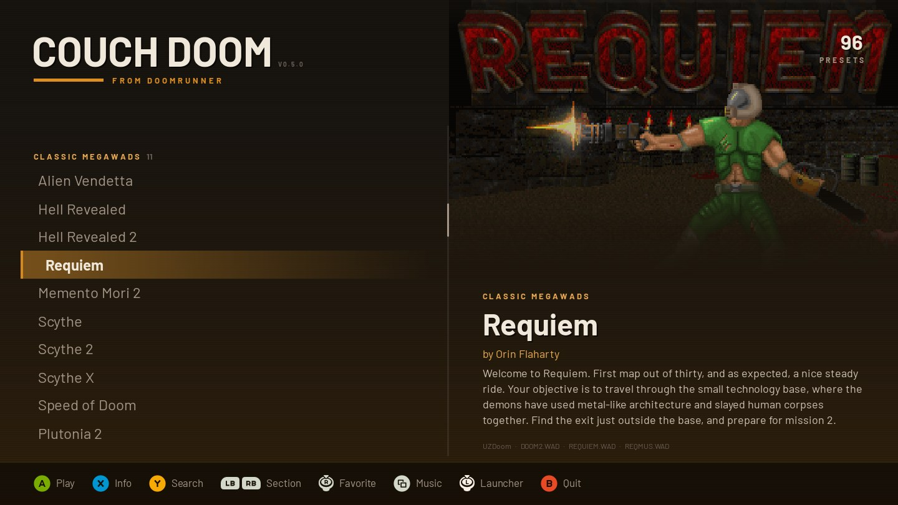
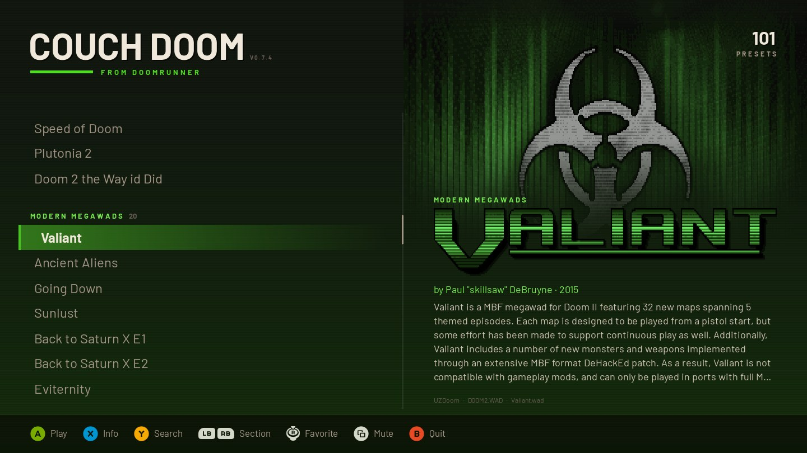
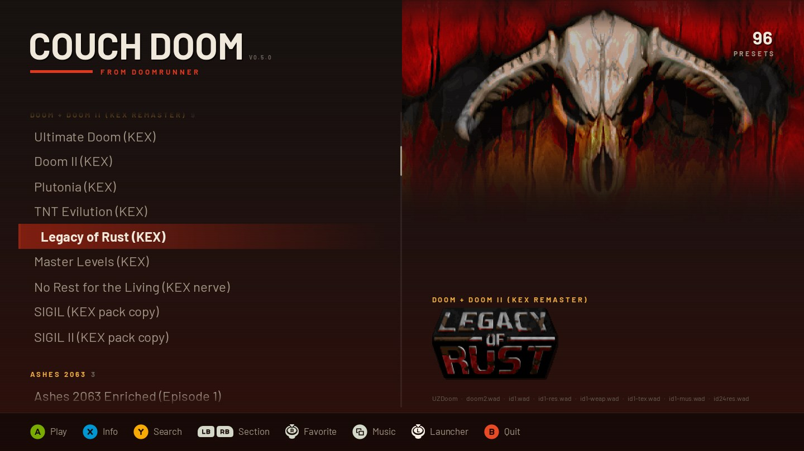
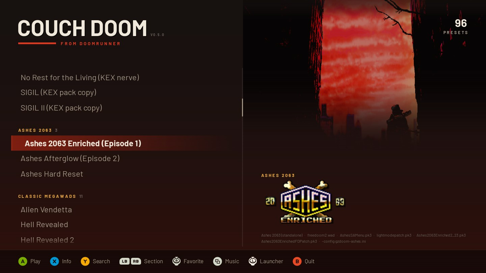
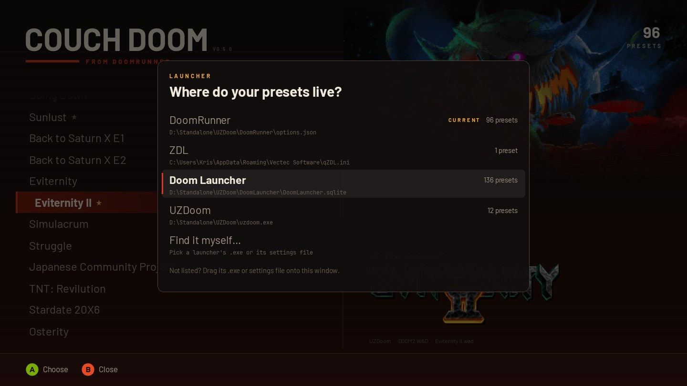
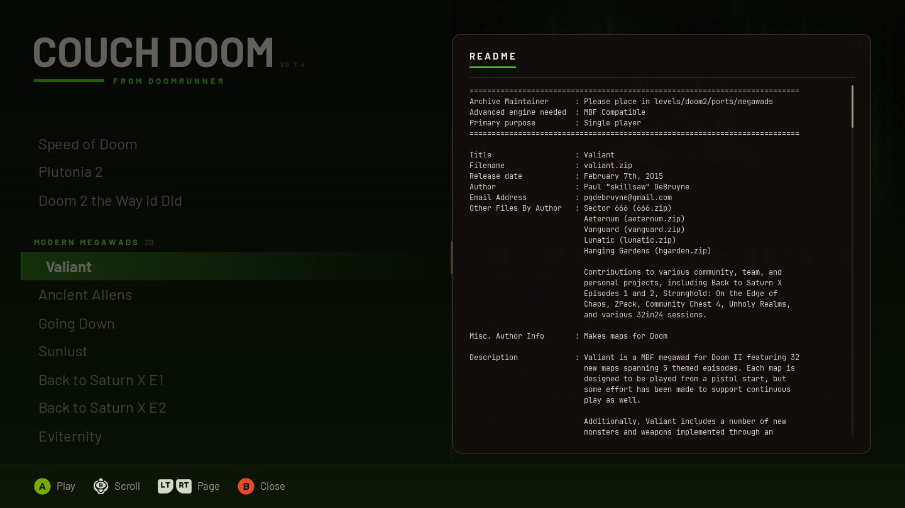
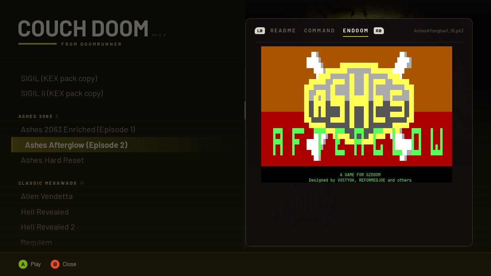

# CouchDoom

A fullscreen, gamepad-friendly front end for the Doom setups you already have. CouchDoom reads the presets saved by your launcher, or the IWADs your source port can find, and shows them big-screen style with each WAD's own title art, music and readme. Pick one and it starts the engine with the same files and arguments your launcher would use.

It only reads other programs' files and never changes them, so keep setting games up in your launcher.



<p>
  
  
</p>
<p>
  
  
</p>
<p>
  
  
</p>

Title art, logos, readmes and ENDOOM screens shown here belong to their WAD authors; CouchDoom reads them from your own files.

## What it works with

### Launchers

| Launcher | OS | What CouchDoom reads | Where it looks |
| --- | --- | --- | --- |
| [DoomRunner](https://github.com/Youda008/DoomRunner) | Windows, Linux, macOS | `options.json` | Windows `%LOCALAPPDATA%\DoomRunner` or `%APPDATA%\DoomRunner`; Linux `~/.local/share/DoomRunner` or its Flatpak folder; macOS `~/Library/Application Support/DoomRunner`; or the `DOOMRUNNER_OPTIONS` env var |
| [ZDL](https://github.com/lcferrum/qzdl) (qZDL / ZDL 3) | Windows, Linux | `qZDL.ini`, plus saved `.zdl` files | Windows `%APPDATA%\Vectec Software`; Linux `~/.config/Vectec Software`. `.zdl` files in the folders ZDL last used and beside its ini |
| [Doom Launcher](https://github.com/nstlaurent/DoomLauncher) | Windows | `DoomLauncher.sqlite` | `%APPDATA%\DoomLauncher` |
| [Doom Launcher 667](https://github.com/Realm667/DoomLauncher667) | Windows | `DoomLauncher.sqlite` | Beside `DoomLauncher667.exe`, `%LOCALAPPDATA%\DoomLauncher667`, or the `DOOMLAUNCHER_DATABASE` env var |

Any engine your launcher runs works, because CouchDoom uses the launcher's own engine list. DoomRunner presets get DoomRunner's per-engine flags, so DSDA-Doom, PrBoom+, Woof, Chocolate Doom, EDGE and the ZDoom family each get arguments they understand.

How presets show up:

- **DoomRunner:** every preset, grouped by its separators, including launch options (map, skill, gameplay and compat flags, video, audio).
- **ZDL:** the setup currently loaded, plus saved `.zdl` files; subfolders become sections.
- **Doom Launcher:** every game with saved settings, and each profile as its own entry; tags become sections. Zipped files it manages are unpacked into `state/unpacked/` when first needed.
- **Doom Launcher 667:** every game, sectioned by collection. Mods it keeps as `.7z`/`.rar` only play from Doom Launcher 667 itself.

### Source ports without a launcher

| Port | What CouchDoom reads | Where it looks |
| --- | --- | --- |
| GZDoom, UZDoom, VKDoom | The port's ini (`[IWADSearch.Directories]`), its `iwadinfo.txt` (inside `game_support.pk3`), and the IWADs it finds | The program: on `PATH`, `Program Files\<Port>`, beside or one folder up from `CouchDoom.exe`, `/Applications/<Port>.app`, `/usr/bin`, or the GZDoom Flatpak. The ini: `<port>_portable.ini` beside the exe or `Documents\My Games\<Port>\<port>.ini` on Windows, `~/.config/<port>/<port>.ini` on Linux, `~/Library/Preferences/<port>.ini` on macOS |

You get one entry per IWAD, named and ordered like the port's own startup picker. That includes the Steam, GOG and Bethesda.net copies the port finds on its own (unless `i_searchdistributors` is off). Add-ons such as Hexen: Deathkings only appear when the game they need is there too. Playing one runs the port with `-iwad`, so its autoload folders and settings apply as usual.

### Finding them

CouchDoom checks the locations above. It also follows Start Menu, Desktop and taskbar shortcuts to any of these programs, which is how portable installs get found. Settings beside `CouchDoom.exe`, or one folder up, count too.

- **One found:** it opens straight on its presets.
- **Several found:** it asks which one and remembers the choice. Switch later with L3 (click the left stick) or F4.
- **None found:** choose **Find it myself…** and pick the launcher, the port, or a settings file, or drag one onto the window.



If the settings can't be read or have no presets, CouchDoom shows what went wrong and the paths it tried, instead of closing.

## Install

Downloads are on the [latest release](https://github.com/KrisEnigma/couch-doom/releases/latest). No Python needed. The app isn't code-signed, so the first start needs one extra click.

- **Windows:** `CouchDoom-…-windows-x64.zip`. Unzip it anywhere and run `CouchDoom.exe`. If SmartScreen warns you, click **More info**, then **Run anyway**.
- **macOS (Apple Silicon):** `CouchDoom-…-macos-arm64.zip`. Unzip it and open `CouchDoom.app`. If macOS says it can't be opened, go to **System Settings → Privacy & Security** and click **Open Anyway**.
- **Linux (x86-64):** `CouchDoom-…-linux-x64.tar.gz`. Extract it and run `./CouchDoom`. It needs glibc 2.35 or newer (Ubuntu 22.04, Fedora 36 or later).

**Arch Linux:** an AUR package is coming soon. Until then, build it from this repo after installing `python-pygame-ce` from the AUR (for example `yay -S python-pygame-ce`):

```bash
git clone https://github.com/KrisEnigma/couch-doom.git
cd couch-doom/packaging/aur
makepkg -si
```

It needs the regular `python-pygame-ce`, not `python-pygame-ce-sdl3`, which is built without sound or controller support.

**From source** (any OS, including Intel Macs): Python 3.11 or newer. On macOS, Apple's built-in Python is too old; get it from [python.org](https://www.python.org/downloads/macos/) or Homebrew.

```bash
git clone https://github.com/KrisEnigma/couch-doom.git
cd couch-doom
python3 -m venv .venv
.venv/bin/pip install -r requirements.txt
.venv/bin/pip install --no-deps tinysoundfont   # MIDI title music; optional
PYTHONPATH=src .venv/bin/python -m couch_doom
```

`pip install .` instead adds a `couch-doom` command.

- **Linux:** the **Find it myself…** dialog needs `zenity` (or `kdialog` on KDE).
- **macOS:** click the file dialog once before typing, because macOS doesn't give it keyboard focus. If GZDoom was downloaded and never opened, open it once from Finder first, so its "downloaded from the internet" prompt doesn't appear behind CouchDoom.

Tested on Arch Linux with DSDA-Doom, DoomRunner and qZDL, and on an M4 MacBook Pro with GZDoom. Steam Deck reports are welcome.

## Controls

| Pad | Keyboard | Does |
| --- | --- | --- |
| D-pad / left stick | Arrows | Move (hold to repeat) |
| A / Start | Enter | Play |
| X | Tab | Info sheet: the readme, plus the ENDOOM screen when the WAD has one |
| Y | `/` or just type | Search |
| R3 (click right stick) | F3 | Add to or remove from Favorites |
| Back / View | F2 | Title music on/off |
| L3 (click left stick) | F4 | Choose launcher |
| LB / RB | Left / Right | Previous / next section |
| LT / RT | PgUp / PgDn | Jump 8 presets |
| B | Esc | Clear the filter, otherwise quit (press twice) |

The mouse works too:

- **Playing:** click a preset to select it, and click it again to play.
- **Scrolling:** the wheel scrolls the list.
- **Going back:** right-click works like B.
- **On-screen controls:** footer prompts, tabs and the search keyboard are clickable.

Favorites get their own section at the top. CouchDoom hides while a game runs and comes back when it exits.

## What you see and hear

Everything comes from the preset's own files, in the order the engine would load them:

- **Backdrop:** the title screen (MAPINFO `titlepage`, `TITLEPIC`, or Heretic/Hexen's `TITLE`). The UI's colours follow its most vivid hue.
- **Logo:** the main-menu logo (`M_DOOM`, `M_HTIC`, `M_STRIFE`), when it's a real custom logo.
- **Title music:** the MAPINFO `titlemusic` or the title lump (`D_DM2TTL`, `D_INTRO`, `MUS_TITL`, …). It plays once and crossfades between presets. MIDI and MUS need a SoundFont: `--soundfont <file>`, any `.sf2`/`.sf3` in a `soundfonts/` folder beside CouchDoom, or one shipped with your engine.
- **Readme:** a same-named `.txt` beside the WAD, or a readme inside the PK3.
- **ENDOOM:** shown only when the preset ships its own.
- **Menu sounds:** taken from your IWAD.

WAD, PK3 and IPK3 are supported; PK7 is not.

<p>
  
  
</p>

## Command line

| Option | Does |
| --- | --- |
| `--windowed` | Run in a window instead of fullscreen |
| `--dry-run [--preset text]` | Print each preset's launch command and exit |
| `--options <file>` | Read one settings file, or a GZDoom/UZDoom/VKDoom program |
| `--launcher <name>` | Only consider `doomrunner`, `zdl`, `doomlauncher`, `doomlauncher667` or `gzdoom` |
| `--soundfont <file>` | SoundFont for MIDI title music |

On Windows from source, `run.bat` passes these through. To run without a console window, point a shortcut at `.venv\Scripts\pythonw.exe -m couch_doom` with `PYTHONPATH` set to the checkout's `src` folder.

## Notes

- **Saved state:** the last played preset, favorites, the music toggle and the chosen launcher are stored in `state/last_played.json`, beside `CouchDoom.exe` or the source checkout. Installed copies use `%LOCALAPPDATA%\CouchDoom`, `~/.local/share/couch-doom` or `~/Library/Application Support/CouchDoom`. Errors are logged to `state/couch-doom.log`.
- **Not supported:**
  - DoomRunner's multiplayer and demo options.
  - Doom Launcher's unmanaged `.7z`/`.rar` files, and its ports with a custom file flag.
- **Building the Windows app:** `pip install pyinstaller`, then `pyinstaller packaging/CouchDoom.spec`. Pushing a `v*` tag builds and publishes it on GitHub Actions.

## Credits and license

CouchDoom is MIT licensed; see [LICENSE](LICENSE).

- **Fonts:** [Barlow](https://github.com/jpt/barlow) and [JetBrains Mono](https://github.com/JetBrains/JetBrainsMono), both SIL OFL.
- **Button prompts:** [Kenney's Input Prompts](https://kenney.nl/assets/input-prompts), CC0. They match the pad you last used: Xbox, PlayStation or Switch.
